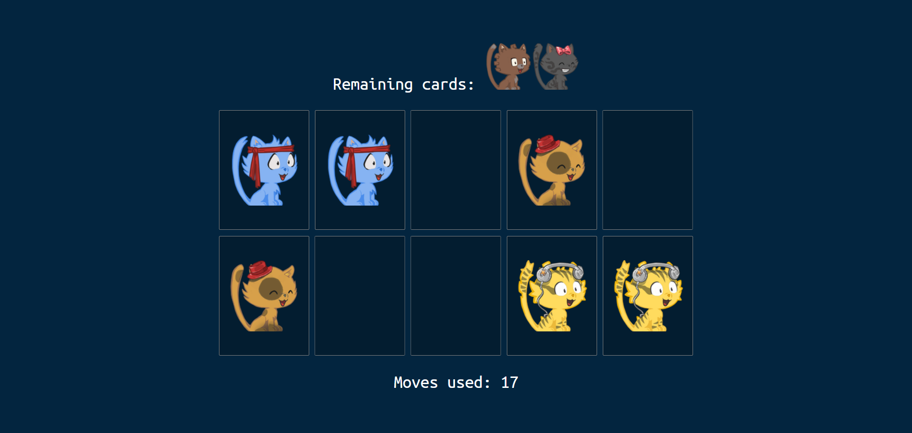

## Memory Game App

This is a Memory Game App using vite(react).

Follow the Given Steps for the run the proect👇

<b>* First Clone replository copy the below text</b>
    
git clone https://github.com/MUNENDRA10/memory-game-vite.git
 
<b>* Go to the path by using this command</b>

cd Memory

<b>Install the npm</b>

npm install

<b>Now run the project using this command</b>

npm run dev

You can see your app at http://localhost:3000

 

